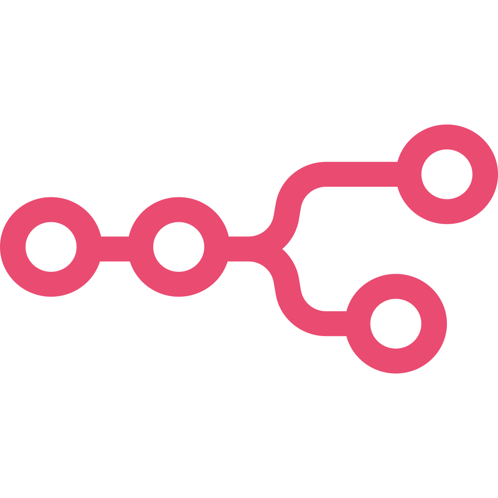
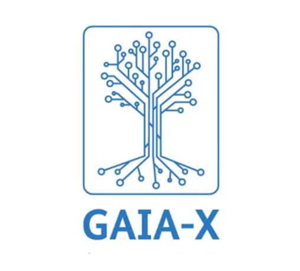

## Hi there, I'm Nicolás Rojas 👋

I'm a software engineer with a data background, building systems end to end in Python and TypeScript. From provisioning cloud infrastructure with Terraform and Docker to writing application logic and wiring up integrations, I like owning the full picture rather than working on just one layer.

I care about how things behave under load, how failures are handled, and whether something actually holds up in production. That mindset applies whether I am building a data pipeline, a backend service, or the infrastructure it runs on.

Automation shapes how I approach work. If a process is manual and repeatable, I would rather build something that makes it unnecessary.

I learn best by building things. When I want to understand a tool or concept, I turn it into a small project and improve it step by step, rather than just following tutorials.

Outside of engineering, I enjoy sports, dancing, learning languages, and working on long-term skills.

## ⚙️ I'm currently working on

> An automated market-making bot that detects low-liquidity conditions and injects liquidity on both sides of the order book. Built end-to-end in Python, from exchange connectivity and order management to position tracking and risk controls.

## 🌱 I'm currently learning 

  

> Exploring low-code automation practices using LangChain and n8n, while steadily improving my German in parallel.

## 🌐 Open Source Contributions

> Contributed to Gaia-X related tooling, focusing on interoperability and structured data models.
